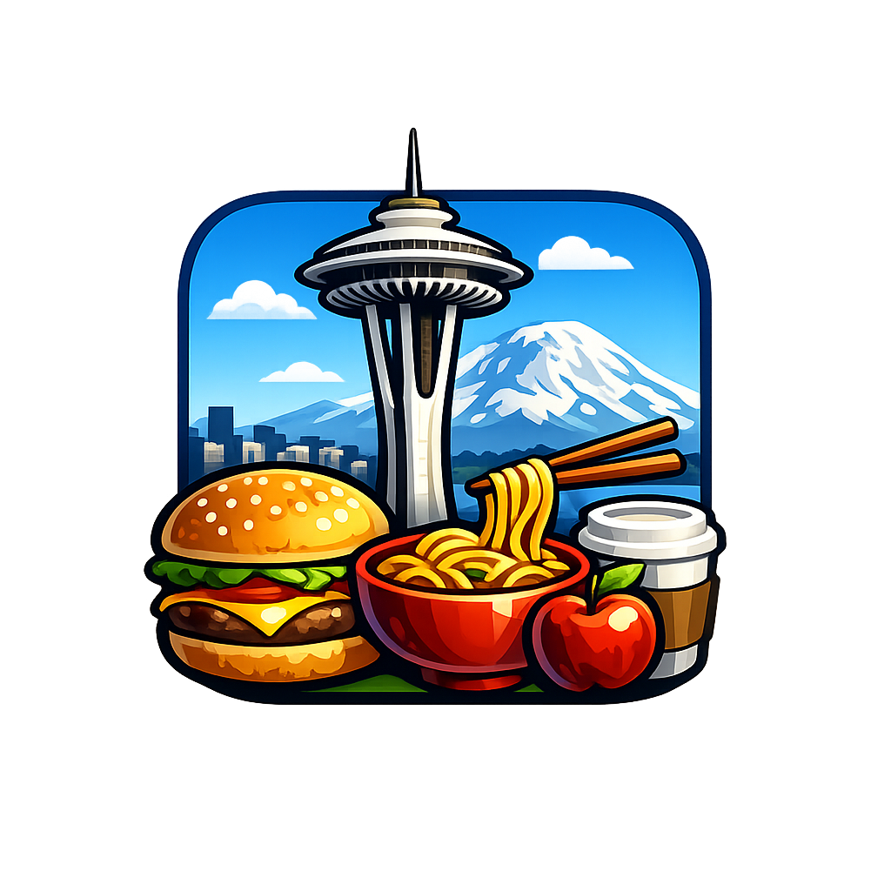

# Seattle Restaurant Dashboard

**Group Members:** Kristy Dang, Jeffrey Junio, Jonny Sung, Paisley Wu, Allen Yuan

***

## Application URL

[https://kridang.github.io/seattle-food-dashboard/](https://kridang.github.io/seattle-food-dashboard/)

***

## Project Description
The Seattle Restaurant Dashboard is an interactive web application that displays restaurants in Seattle. It uses an interactive map and dynamic charts to visualize restaurant locations, ratings, prices, and categories.

***

## Goals
The Seattle Food Dashboard is an smart dashboard designed to help Seattle residents explore restaurants in Seattle and identify places that match their preferences. The dashboard allows users to quickly discover popular dining options and compare restaurant attributes through interactive visualizations.

***

## Favicon
  
*Custom favicon featuring the Space Needle in the background with food elements*

***

## Functions
- Interactive Map: Restaurants are displayed as point locations on a Mapbox map. Users can zoom and pan to explore different neighborhoods in Seattle.
- Filtering Tools: Allows users to filter restaurants by price level, rating, and category. The map and charts update dynamically based on the selected filters.
- Restaurant Information Panel: Clicking on a restaurant point reveals key attributes such as rating, number of reviews, price level, and location.
- Dynamic Charts: Pie and bar charts update automatically based on the restaurants currently visible on the map.

- Tutorial: Clicking on the question mark icon on the bottom right corner shows a tutorial on how to use the website.

***

## Applied Libraries
- **Mapbox**: Library used to build the interactive basemap and visualize restaurant locations as point features.
- **C3**: Library used to generate dashboard charts.
- **Github**: Version control and hosted project repository for collaboration.
- **Kaggle**: Platform used to access the Seattle restaurant dataset created from the Yelp Business API.

## Data Sources
- **Kaggle - Seattle Area Restaurants** – Data collected from YELP: [Restaurant Data](https://www.kaggle.com/datasets/oklena/seattle-area-restaurants)

***

## Other Notes
- This project relies on a a 4-year old dataset from Kaggle, that originally was derived from YELP. Information from the dashboard provided may not be up-to-date.
- The map is designed to work on desktop and laptop screens
- Future Improvements include using an updated (or API fetch) dataset, additional restaurant attributes, foot traffic / busy hours visualization.
- **LIMITATION**: Yelp data may introduce popularity bias and the Kaggle dataset contains only a subset of restaurants and does not represent all of Seattle's restaurants. 

## Acknowledgment
We would like to thank Professor Zhao and GEOG458 teaching assistants for their guidance throughout the development of this project.

## AI Usage Disclosure
ChatGPT was used to produce the favicon for this project. All coding, data processing, and dashboard implementation were performed by the group.